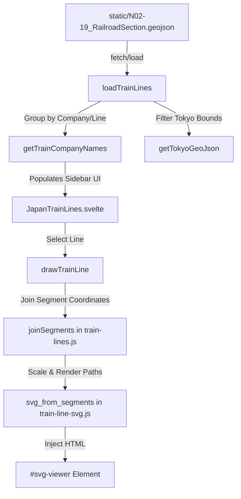

# Agent Onboarding Guide (AGENTS.md)

Welcome to the **Tokyo Train Line Maps** codebase (`@liquidx/liquidx-japan-train-lines`). This repository is a Svelte component library that visualizes public Japanese railroad GeoJSON data (provided by the Japanese Government GIS website / 国土数値情報) as interactive SVG maps.

---

## 1. Project Purpose & Context

This codebase provides two things:
1. **A Svelte Component Library (`src/lib`)**: Centered around [JapanTrainLines.svelte](file:///Users/liquidx/p/liquidx-japan-train-lines/src/lib/JapanTrainLines.svelte), this component loads GeoJSON data, lets users browse train companies and their lines, and renders SVG maps.
2. **A SvelteKit Web Application**: A lightweight shell (`src/routes/+page.svelte`) used for local development, testing, and debugging.

---

## 2. Directory Structure & Key Files

Here is an overview of the key files and their responsibilities:

### Core Library (`src/lib/`)
* **[JapanTrainLines.svelte](file:///Users/liquidx/p/liquidx-japan-train-lines/src/lib/JapanTrainLines.svelte)**: The main Svelte component. It renders a sidebar listing train companies/lines and binds an SVG rendering container. It handles click interactions, mounts keyboard listeners (ArrowRight to traverse lines), and orchestrates data rendering.
* **[japan-train-lines.js](file:///Users/liquidx/p/liquidx-japan-train-lines/src/lib/japan-train-lines.js)**: Handles loading the GeoJSON file (`loadTrainLines`) and coordinates drawing line/region views (`drawTrainLine`). Also contains hardcoded coordinates bounding-box filters for limiting features to the Tokyo metropolitan region.
* **[train-lines.js](file:///Users/liquidx/p/liquidx-japan-train-lines/src/lib/train-lines.js)**:
  * `lineNames(geojson)`: Groups features by company name and train line name.
  * `joinSegments(segments)`: **Crucial Algorithm.** The raw GIS GeoJSON contains many disjointed segment lines for a single railway line. This function loops through all segments and matches coordinate endpoints to stitch them into continuous paths. It handles reversals (reversing coordinate arrays) if segments are oriented differently.
* **[train-line-svg.js](file:///Users/liquidx/p/liquidx-japan-train-lines/src/lib/train-line-svg.js)**: Computes the bounding box of coordinates, maps latitude/longitude coordinates to SVG canvas space (reversing Y-axis since GIS Y increases upwards while SVG Y increases downwards), applies segment-level corrections, and outputs the `<svg>` path tags.
* **[tokyo-train-lines.js](file:///Users/liquidx/p/liquidx-japan-train-lines/src/lib/tokyo-train-lines.js)**: Standard lookup lists of Tokyo-centric train operating companies and their lines to filter nationwide data.
* **[train-line-corrections.json](file:///Users/liquidx/p/liquidx-japan-train-lines/src/lib/train-line-corrections.json)**: Configuration to correct GIS anomalies (e.g., adding overlapping sections of `東北線` and `東海道線` into the `山手線` view, and setting coordinate bounding filters).

### Routes & App Config (`src/`)
* **[+page.svelte](file:///Users/liquidx/p/liquidx-japan-train-lines/src/routes/%2Bpage.svelte)**: Instantiates `<JapanTrainLines>` pointing to `/N02-19_RailroadSection.geojson`.
* **[app.html](file:///Users/liquidx/p/liquidx-japan-train-lines/src/app.html)**: Global page HTML template.

### Scripts & Tooling (`tools/` & `test/`)
* **[tools/combine-svg-paths.js](file:///Users/liquidx/p/liquidx-japan-train-lines/tools/combine-svg-paths.js)**: Developer utility to parse and merge adjacent SVG `<path>` and `<polyline>` elements using `svgson`.
* **[tools/export-svg.js](file:///Users/liquidx/p/liquidx-japan-train-lines/tools/export-svg.js)**: CLI tool to filter GeoJSON data and export a static SVG file for a specific line.
* **[test/train-lines.test.mjs](file:///Users/liquidx/p/liquidx-japan-train-lines/test/train-lines.test.mjs)**: Unit tests (using Vitest) verifying the segment-joining and JSON line-parsing algorithms.

---

## 3. Data Flow & Rendering Details



### Segment Joining Algorithm
The `joinSegments(segments)` function works by:
1. Extracting coordinates of the first segment and setting its start/end coordinates as `head` and `tail`.
2. Greedily searching the remaining segments to find one that has a start or end matching current `head` or `tail`.
3. If matched, it concatenates coordinates, handles reversals if needed, and updates `head`/`tail`.
4. If no matching segments are left to join, the path is completed and added to paths list, and a new chain is started.

---

## 4. Development Workflow

### Requirements
* **Node.js**: Modern LTS version recommended.
* **Package Manager**: `pnpm` is configured (lockfile is [pnpm-lock.yaml](file:///Users/liquidx/p/liquidx-japan-train-lines/pnpm-lock.yaml)).

### Local Development
To launch the Vite development server and view the UI:
```bash
pnpm install
pnpm run dev
# Server runs at http://localhost:5173/
```

### Building & Packaging
The Svelte component package is built using:
```bash
pnpm run build
```
This builds Vite assets and then executes `npm run package` which syncs SvelteKit config, runs `svelte-package` (packaging `src/lib/` to `dist/`), and runs `publint` to check package entrypoints.

### Packaging Configuration
* The export entrypoint is configured in `package.json` under `exports`. It routes to `./dist/index.js` and typescript types to `./dist/index.d.ts`.
* The package is published to **GitHub Packages** (`https://npm.pkg.github.com`).
* Release tagging and creation is handled by `./publish.sh` using GitHub CLI (`gh`).

---

## 5. Known Issues & Quirks for Agents

1. **GeoJSON Filenames**:
   The code in `src/routes/+page.svelte` points to `/N02-19_RailroadSection.geojson`. The files are saved inside the [static/](file:///Users/liquidx/p/liquidx-japan-train-lines/static) directory.
2. **SVG Interactive Events**:
   Hovering over rendered SVG segments sets their `stroke` to `red` and `stroke-width` to `4` via imperative vanilla JS event listeners attached in `drawTrainLine` (in `src/lib/japan-train-lines.js`).
