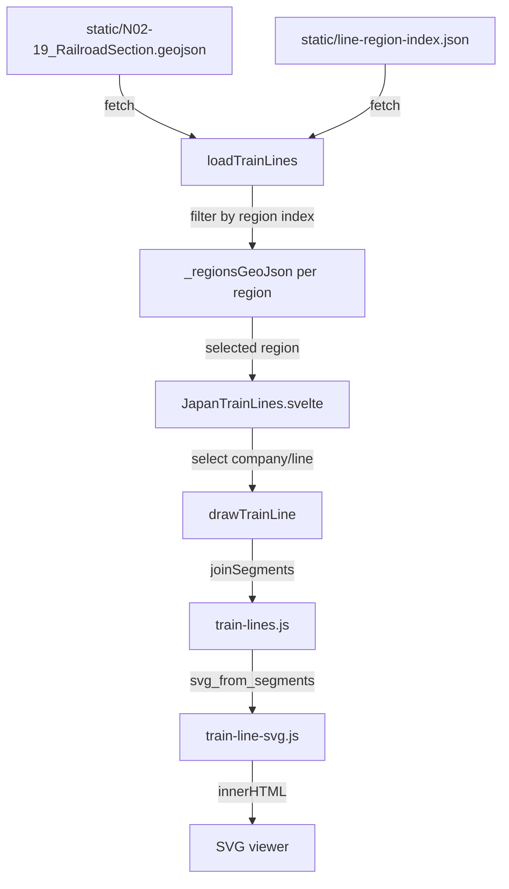

# Agent Onboarding Guide

Welcome to the **Japan Train Line Maps** codebase (`@liquidx/liquidx-japan-train-lines`). This repository is a Svelte 5 component library that visualizes public Japanese railroad GeoJSON data (provided by the Japanese Government GIS website / 国土数値情報) as interactive SVG maps.

---

## 1. Project Purpose & Context

This codebase provides two things:
1. **A Svelte Component Library (`src/lib`)**: Centered around `JapanTrainLines.svelte`, this component loads GeoJSON data, lets users browse train companies and their lines, and renders SVG maps.
2. **A SvelteKit Web Application**: A lightweight shell (`src/routes/+page.svelte`) used for local development, testing, and debugging.

---

## 2. Directory Structure & Key Files

### Core Library (`src/lib/`)

| File | Responsibility |
|---|---|
| `JapanTrainLines.svelte` | Root component. Manages pan/zoom state, touch gestures, station tooltips, keyboard shortcuts, and URL sync. Composes `LineSelector` and `MapAppearanceControls`. |
| `LineSelector.svelte` | Sidebar panel listing regions, companies, and lines. Collapses on both mobile and desktop. Mobile uses an accordion; desktop uses a two-column layout. |
| `MapAppearanceControls.svelte` | HUD overlay (bottom-right) with zoom buttons, theme toggle, and display option toggles. Includes a debug "Region polygon" toggle. |
| `CompanyCell.svelte` | Button cell for a single railway company. |
| `LineCell.svelte` | Button cell for a single train line with color dot. |
| `ToggleOption.svelte` | Labelled toggle switch used inside `MapAppearanceControls`. |
| `japan-train-lines.js` | `loadTrainLines` fetches all GeoJSON + the precomputed index, builds per-region GeoJSON caches, and stores them in module-level state. `drawTrainLine` renders the SVG for the selected region/company/line. |
| `train-lines.js` | `lineNames` groups features by company/line. `joinSegments` stitches disjointed GIS segments into continuous paths. |
| `train-line-svg.js` | Projects lat/lng → SVG coordinates, builds the SVG string. Also contains `escapeRegExp` for safe regex filtering. |
| `regions.js` | Defines all geographic regions with `id`, `name`, `nameJa`, `bounds` (viewport rectangle), and `prefectures` (array of 2-digit ISO prefecture codes). **Single source of truth for region definitions.** |
| `line-name-mapping.js` | Japanese→English name mappings for lines (`lineNameMapping`) and companies (`companyNameMapping`). |
| `line-colors.js` | Maps company+line to hex colors for dark/light themes. |
| `train-line-corrections.json` | Overrides per line: `includes` (extra segments to add) and `filters` (bounding-box clamps). Used to correct GIS anomalies e.g. stitching 東北線 into 山手線. |
| `tokyo-train-lines-data.js` | Hardcoded allowlists for the special Tokyo region filter (company names + line names). |

### Routes (`src/routes/`)

| File | Responsibility |
|---|---|
| `+page.svelte` | Dev harness. Instantiates `<JapanTrainLines>` pointing to the static GeoJSON files. |
| `app.html` | Global HTML shell. |

### Tools (`tools/`)

| Script | Purpose |
|---|---|
| `build-prefecture-polygons.js` | Reads the high-res prefecture GeoJSON from `open-data-jp-prefectures-geojson`, simplifies each polygon with Douglas-Peucker (tolerance 0.01°), and writes `static/prefecture-polygons.json` (~326 KB). Used by the debug overlay. |
| `build-line-region-index.js` | Reads `static/N02-19_RailroadSection.geojson` + `static/prefecture-polygons.json` + **`src/lib/regions.js` directly** (imported at runtime), and writes `static/line-region-index.json` (~16 KB) mapping `"company::line" → [regionId, ...]`. This is the precomputed index used at runtime for O(1) region filtering. |
| `combine-svg-paths.js` | Utility to merge adjacent SVG `<path>`/`<polyline>` elements. |
| `export-svg.js` | CLI to export a static SVG for a specific line. |
| `get-data.sh` | Downloads the source GeoJSON from the Japanese Government GIS website. |

### Tests (`test/`)

* `train-lines.test.mjs` — Vitest unit tests for `joinSegments` and `lineNames`.

### Generated Static Files (`static/`)

These are committed outputs from the build tools and should be regenerated whenever the railroad GeoJSON or region definitions change:

| File | Generated by | Used for |
|---|---|---|
| `N02-19_RailroadSection.geojson` | `pnpm run data` | Source railroad data |
| `N02-19_Station.geojson` | `pnpm run data` | Station dot positions |
| `japan-outline.geojson` | `pnpm run data` | Base map outline |
| `prefecture-polygons.json` | `pnpm run build:prefectures` | Debug region polygon overlay |
| `line-region-index.json` | `pnpm run build:index` | Runtime region filtering (O(1) lookup) |

---

## 3. Svelte Version & Conventions

All components are written in **Svelte 5 runes mode** (`<svelte:options runes={true} />`):

- Props: `let { foo = $bindable(default), bar } = $props()`
- State: `let x = $state(value)`
- Derived: `let y = $derived(expr)`
- Side effects: `$effect(() => { ... })`
- DOM events: `onclick`, `onmousedown`, etc. (not `on:click`)
- Component callbacks: passed as props (`onselectregion={fn}`) not dispatched events
- Slots replaced with snippet props: `{@render children?.()}`

---

## 4. Data Flow



### Region Filtering (how lines are assigned to regions)

Region membership is **precomputed at build time**, not at runtime:

1. `tools/build-prefecture-polygons.js` simplifies the official prefecture boundary GeoJSON.
2. `tools/build-line-region-index.js` tests each railroad feature's coordinates against the simplified prefecture polygons (ray-casting), producing `line-region-index.json`.
3. At runtime, `filterGeoJsonByRegion` does a single `.filter()` with a hash lookup — no polygon math.

Region definitions live in `src/lib/regions.js`. Each region lists its prefecture ISO codes (`"01"`–`"47"`). The build script imports `regions.js` directly, so there is only one place to edit when adding or changing regions.

### Segment Joining Algorithm

`joinSegments` in `train-lines.js` stitches GIS segments (which are stored as disconnected pieces) into continuous polylines:
1. Takes the first segment as the initial chain; records its `head` and `tail` endpoints.
2. Greedily scans remaining segments for one whose start or end matches `head` or `tail`.
3. Appends it (reversing coordinates if needed) and updates `head`/`tail`.
4. When no match is found, saves the chain and starts a new one.

---

## 5. Development Workflow

### Requirements

- **Node.js**: LTS version (20+)
- **Package manager**: `pnpm`

### Getting data

Download the Japanese Government GIS railroad data into `static/`:
```bash
pnpm run data
```

### Regenerating precomputed static files

Run this after changing `regions.js`, prefecture assignments, or replacing the railroad GeoJSON:
```bash
pnpm run build:static        # runs both steps below in sequence
pnpm run build:prefectures   # → static/prefecture-polygons.json
pnpm run build:index         # → static/line-region-index.json
```

### Local development

```bash
pnpm install
pnpm run dev
# http://localhost:5173/
```

### Building the package

```bash
pnpm run build    # vite build + svelte-package + publint
```

### Running tests

```bash
pnpm test
```

### Publishing a release

```bash
pnpm run release  # tags and creates a GitHub release via ./publish.sh
```

The package is published to **GitHub Packages** (`https://npm.pkg.github.com`). The export entrypoint routes to `./dist/index.js`.

---

## 6. Known Quirks

1. **GeoJSON filenames**: `+page.svelte` points to `/N02-19_RailroadSection.geojson`. Files live in `static/`.
2. **Tokyo is a special region**: The Tokyo region uses `getTokyoGeoJson`, which applies an explicit company+line allowlist on top of a bounding-box filter, rather than the standard prefecture polygon approach. This is because Tokyo lines are tightly interleaved with lines from neighboring prefectures.
3. **SVG is injected as innerHTML**: `drawTrainLine` sets `viewerEl.innerHTML` directly. Hover effects on segments are wired up imperatively with `addEventListener` after injection.
4. **Region polygon debug tool**: Toggle "Region polygon" in Map Appearance controls to overlay the prefecture shapes for the active region. This fetches `prefecture-polygons.json` fresh each time.
5. **Line name regex escaping**: Company and line names can contain regex special characters (e.g. parentheses). `escapeRegExp` in `train-line-svg.js` sanitises them before constructing `RegExp` objects.
