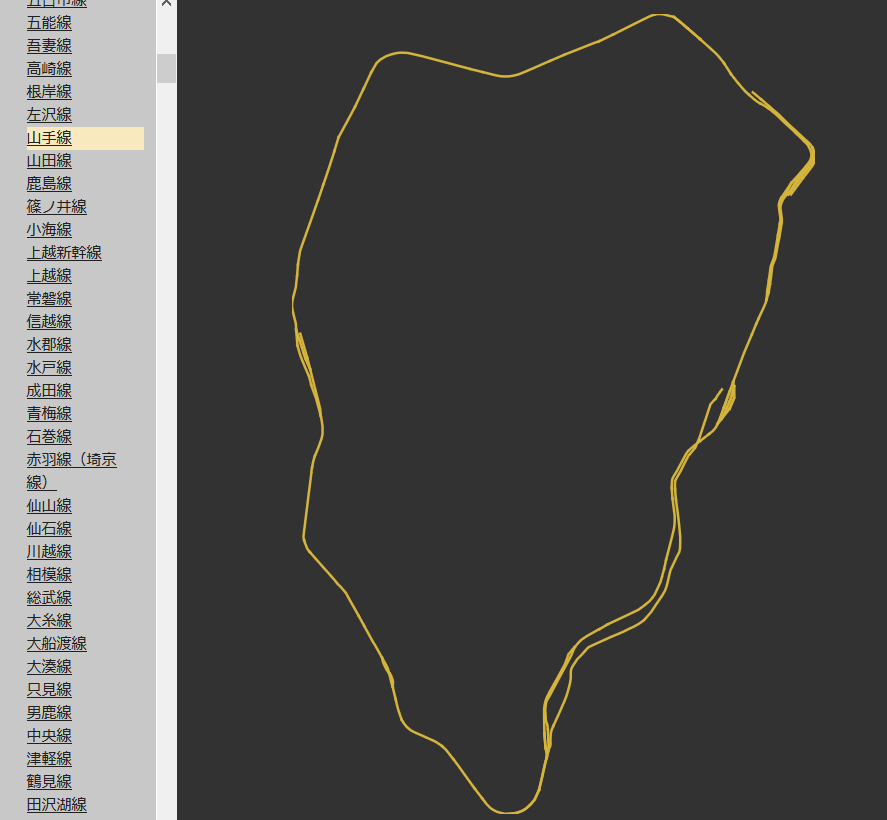

# Japan Train Line Maps

A web-based tool to inspect Japanese railroad data from 国土数値情報 (Japan's National Land Information). Packaged as a Svelte 5 component so it can be embedded in other Svelte projects.



---

## Setup

### 1. Install dependencies

```bash
pnpm install
```

### 2. Download GIS data

The railroad GeoJSON is not included in the repo. Download it from the Japanese Government GIS website:

```bash
pnpm run data
```

This runs `tools/get-data.sh` which downloads and extracts the following files into `static/`:

- `N02-19_RailroadSection.geojson` — railroad line segments
- `N02-19_Station.geojson` — station points
- `japan-outline.geojson` — Japan coastline for the base map

### 3. Build precomputed static files

Two small JSON files need to be generated from the GIS data. These are committed to the repo, but must be regenerated whenever the railroad GeoJSON or region definitions change:

```bash
pnpm run build:static
```

This runs two steps in sequence:

| Command | Output | Purpose |
|---|---|---|
| `pnpm run build:prefectures` | `static/prefecture-polygons.json` | Simplified prefecture boundary shapes for the debug overlay |
| `pnpm run build:index` | `static/line-region-index.json` | Precomputed `company::line → [region]` lookup for fast region filtering |

### 4. Start the dev server

```bash
pnpm run dev
# http://localhost:5173/
```

---

## Scripts

| Command | Description |
|---|---|
| `pnpm run dev` | Start Vite dev server |
| `pnpm run build` | Build the component library for publishing |
| `pnpm run package` | Package `src/lib/` into `dist/` via svelte-package |
| `pnpm run data` | Download GIS data from the Japanese Government |
| `pnpm run build:static` | Regenerate both precomputed JSON files |
| `pnpm run build:prefectures` | Regenerate `static/prefecture-polygons.json` |
| `pnpm run build:index` | Regenerate `static/line-region-index.json` |
| `pnpm run test` | Run Vitest unit tests |
| `pnpm run check` | Run svelte-check type checking |
| `pnpm run release` | Tag and publish a release via `./publish.sh` |

---

## Using the component

The package is published to GitHub Packages:

```bash
npm install @liquidx/liquidx-japan-train-lines
```

```svelte
<script>
  import { JapanTrainLines } from '@liquidx/liquidx-japan-train-lines';
</script>

<JapanTrainLines
  railroadGeoJsonUrl="/N02-19_RailroadSection.geojson"
  stationGeoJsonUrl="/N02-19_Station.geojson"
  japanOutlineGeoJsonUrl="/japan-outline.geojson"
/>
```

You must serve the three GeoJSON files and the two precomputed static files from your own server.

---

## Architecture notes

- All components use **Svelte 5 runes mode**.
- Region filtering is **precomputed at build time** — `line-region-index.json` maps each `company::line` to the regions it belongs to. Runtime filtering is a single hash lookup with no polygon math.
- Region definitions are in `src/lib/regions.js`. Each region lists which prefecture ISO codes (`"01"`–`"47"`) it covers. The build scripts import this file directly, so regions only need to be defined in one place.
- See `AGENTS.md` for a full architecture reference intended for AI coding assistants.

---

## Data source

Railroad and station data: [国土数値情報 鉄道データ](https://nlftp.mlit.go.jp/ksj/gml/datalist/KsjTmplt-N02-v2_3.html) — Ministry of Land, Infrastructure, Transport and Tourism, Japan.
